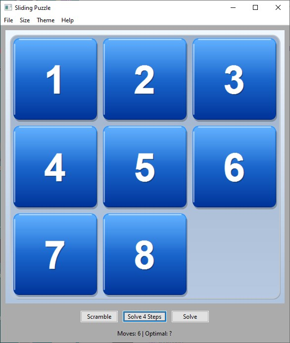

# Slider

Slider is a polished sliding puzzle game built with wxWidgets. Move the tiles into order, choose a board size, and use the built-in solver when you want a little help. The release workflow publishes Windows, Linux, and macOS assets together, including checksums for verification.

## Downloads

- [Windows installer](https://github.com/promptengineer1768/slider/releases/download/v1.0.1/slider-1.0.1-win64.exe)
- [Windows zip](https://github.com/promptengineer1768/slider/releases/download/v1.0.1/slider-1.0.1-win64.zip)
- [Release page](https://github.com/promptengineer1768/slider/releases/tag/v1.0.1)

If you want the simplest setup, use the installer. If you prefer a portable download, use the zip.

The same release also includes Linux and macOS packages plus a `SHA256.txt` file for integrity checks.

## What You Get

- A classic sliding puzzle with multiple board sizes
- A built-in solver for hints or a clean finish
- Audio feedback for sliding and completing a puzzle
- Visual themes that keep the game feeling fresh
- A straightforward menu with puzzle controls and an About screen

## Playing

The goal is simple: arrange the numbered tiles in order by sliding them into the empty space. Start with a smaller board if you want an easier warm-up, then try a larger one for a tougher challenge.

## Build Notes

- Windows packaging includes the executable, resources, sound assets, a ZIP archive, an MSI, and an Inno Setup installer.
- Linux packaging produces tarball, DEB, and RPM assets.
- macOS packaging produces DMG and tarball assets.

## More Info

Open the About menu in the app for a short description of the game and its features.
